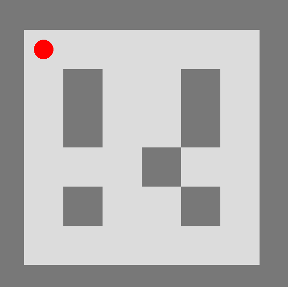
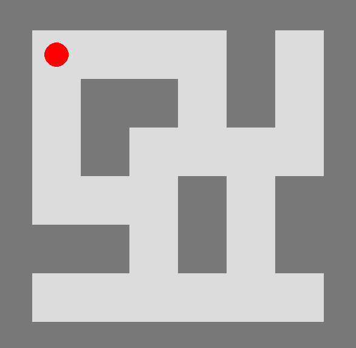
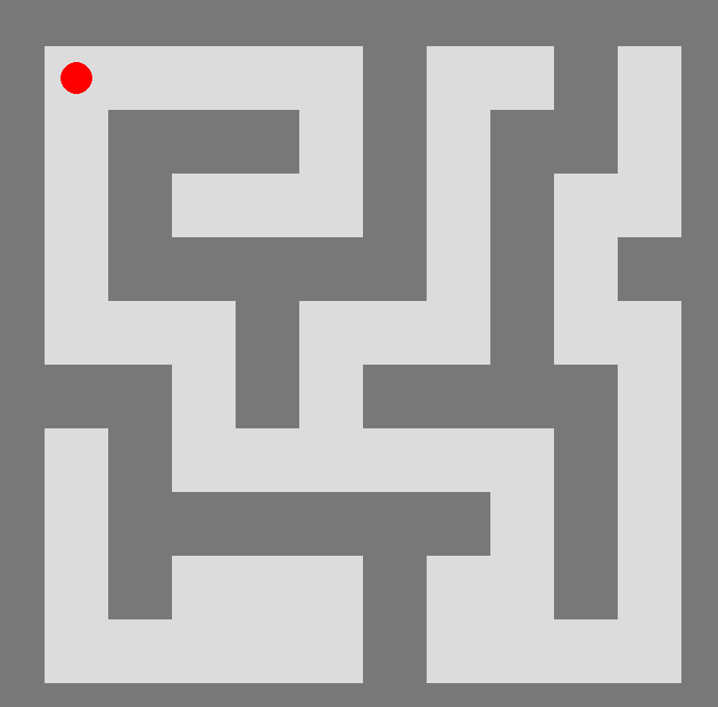
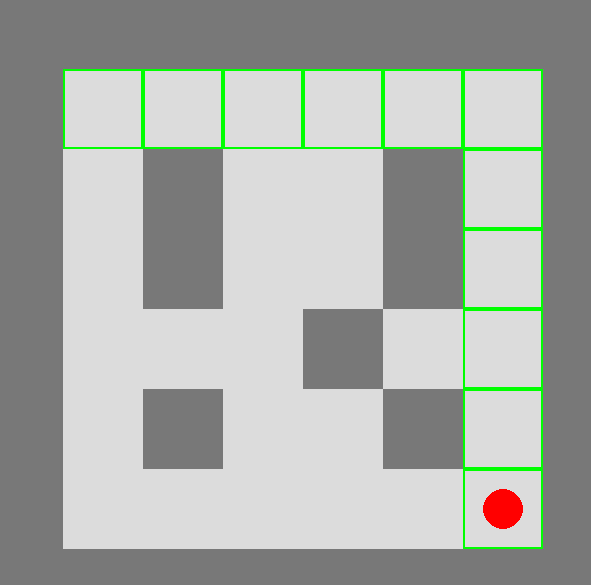
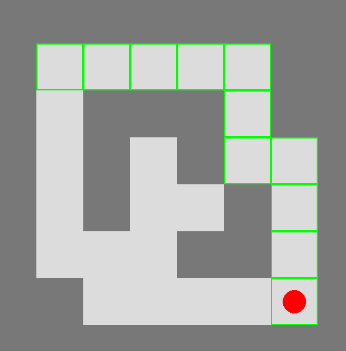
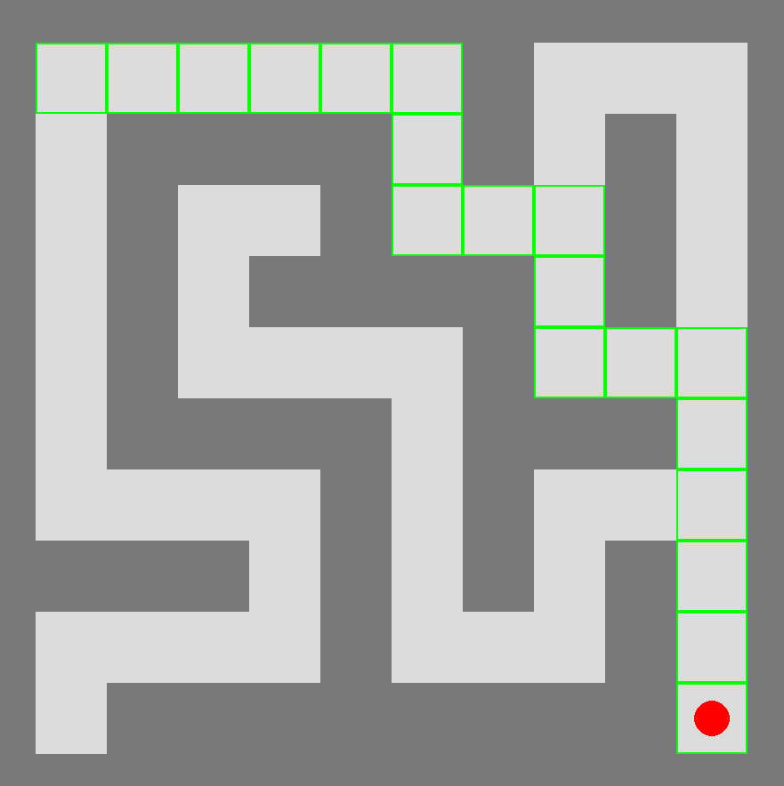

# Resolución de Laberintos: ChatGPT vs (BFS, DFS, A*, Wall Follower)

---

## Índice
1. [Introducción](#introducción)  
2. [Características principales](#características-principales)  
3. [Algoritmos implementados](#algoritmos-implementados)  
4. [Requisitos e instalación](#requisitos-e-instalación)  
5. [Cómo ejecutar el proyecto](#cómo-ejecutar-el-proyecto)  
6. [Galería de niveles](#galería-de-niveles)  
7. [Resultados con ChatGPT/GPT-4/etc.](#resultados-con-chatgptgpt-4etc)    
8. [licencia](#créditos-y-licencia)

---

## Introducción

**ChatGPT vs (BFS, DFS, A*, Wall Follower)** es un proyecto que permite:

- Cargar distintos **laberintos** en formato de texto para su resolución.
- **Resolver** esos laberintos con múltiples algoritmos: BFS, DFS, A*, Wall Follower, e incluso invocar la API de OpenAI para que un modelo de lenguaje intente proponer una ruta.
- Visualizar en **tiempo real** cómo el robot se mueve paso a paso a través del laberinto.
- Probar la eficacia de varios modelos de ChatGPT (ChatGPT-3, ChatGPT-4, “o1-preview”, etc.) frente a retos sencillos para un humano, pero no siempre triviales para la IA.

El proyecto **surgió** con el fin de analizar cómo se comportan diferentes IAs en la tarea de resolver laberintos básicos. Los resultados son diversos: a veces resuelven los niveles sencillos, pero en otras ocasiones **se “inventan” rutas inexistentes** o fallan, principalmente modelos más básicos.

---

## Características principales

- **Múltiples niveles**: Desde pequeños laberintos de 8×8 hasta escenarios de 12×12.  
- **Menú de selección de nivel**: Revisa los archivos en `data/mazes/`.  
- **Menú o entrada textual**: Permite elegir el algoritmo (BFS, DFS, A*, Wall Follower, OpenAI).  
- **Movimiento manual**: Usa las flechas para manejar un robot paso a paso y comprobar cómo se comportan los algoritmos en zonas específicas del laberinto.  
- **Visualización**: El laberinto se dibuja con Pygame, y la ruta se resalta en verde mientras el robot avanza.  
- **Integración con OpenAI**: Envía la descripción del laberinto a la API y, si la respuesta es coherente, utiliza esa ruta para mover el robot.

---

## Algoritmos implementados

1. **BFS (Breadth-First Search)**: Garantiza la ruta más corta en laberintos con coste uniforme.  
2. **DFS (Depth-First Search)**: Encuentra una ruta, no necesariamente la óptima.  
3. **A\***: Utiliza distancia Manhattan como heurística, ofreciendo rutas más eficientes.  
4. **Wall Follower**: Sigue la pared derecha o izquierda.  
5. **OpenAI**:  
   - Envía la descripción del laberinto (rows, cols, grid) a un modelo (gpt-4, “o1-preview”, etc.).  
   - Interpreta la respuesta y trata de parsearla como lista de celdas `(row, col)`.  
   - Puede fallar o inventar rutas, en especial en laberintos más complejos.
   - Existen dos archivos de API: openai_api_gpt.py y openai_api_o1.py Esto se debe a que la configuración para el modelo “o1” es distinta a la de GPT. Por defecto, el proyecto utiliza el modelo GPT, pero si deseas probar con “o1”, debes usar las funciones del archivo openai_api_o1.py 

---

## Requisitos e instalación

1. **Python 3.9+**  
2. **Pygame**  
3. **OpenAI** (0.28)  
4. **Clonar** este repositorio:
   ```bash
   git clone https://github.com/moises60/.git
   ```
> **Nota**: Si utilizas **Azure** u otros endpoints, ajusta las variables como `OPENAI_API_KEY`, `max_completion_tokens`, `temperature`, etc.

---

## Cómo ejecutar el proyecto

1. Asegúrate de que existan archivos `levelX.txt` en `data/mazes/`.  
2. Ejecuta el archivo principal:
   ```bash
   python main.py
   ```
3. Aparecerá un **menú** para seleccionar el nivel.  
4. Luego, en consola, elige el algoritmo: “B”, “D”, “A”, “W” u “O”. También puedes mover manualmente el robot con flechas o reiniciarlo con “R”.  
5. Observa la ventana de Pygame:
   - **Manual**: desplaza al robot con las flechas.  
   - **BFS/DFS/A*/Wall Follower/OpenAI**: el robot recorrerá la ruta (si la encuentra) en pasos automáticos.

---

## Galería de niveles

Aquí se muestran algunos ejemplos (imágenes en `docs/`):

### Nivel 1 (8×8)



### Nivel 2 (8×8)



### Nivel 3 (8×8)


---

## Resultados con ChatGPT/GPT-4/etc.

En nuestras pruebas:

- **ChatGPT-3 / GPT-4** tuvieron dificultades en niveles más complejos, o se inventaban pasos inexistentes.  
- **GPT-4** resolvió algunos laberintos de 8×8 de forma correcta, aunque no siempre consistente.  
- **o1-preview** se comportó razonablemente bien en laberintos sencillos, aunque sigue fallando en niveles grandes.

### Ejemplo de salida

### EJEMPLOS

Solicitando ruta a OpenAI...
Respuesta de OpenAI: [(1, 1), (1, 2), (1, 3), (1, 4), (1, 5), (1, 6), (2, 6), (3, 6), (4, 6), (5, 6), (6, 6)]
OpenAI: ruta con 11 celdas.
Robot llegó al destino.


Solicitando ruta a OpenAI...
Respuesta de OpenAI: [(1, 1), (1, 2), (1, 3), (1, 4), (1, 5), (2, 5), (3, 5), (3, 6), (4, 6), (5, 6), (6, 6)]
OpenAI: ruta con 11 celdas.
Robot llegó al destino.


Laberinto level6.txt cargado. Iniciando escena de juego...
Calculando ruta con A*...
A*: Ruta con 19 celdas encontrada.
Robot llegó al destino.
---
## licencia

**Licencia MIT**.  